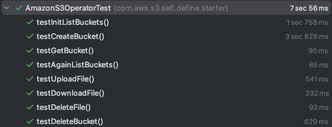

# Aws-s3-spring-boot-starter-github-repo
This repo is for a project which pack AWS S3 Java Operation into a Spring Boot starter with the latest aws 2.x sdk (1.x will not be supported since end of 2025).

## Steps To Use The Starter
There are 3 Steps. Can follow the example project <code>aws-s3-spring-boot-starter-example</code>.
### 1. Add Maven Dependency In Spring Boot Project
<h5 a><strong><code>aws-s3-spring-boot-starter-example/pom.xml</code></strong></h5>
```xml
<dependency>
            <groupId>com.aws.s3.self.define.starter</groupId>
            <artifactId>aws-s3-spring-boot-starter</artifactId>
            <version>0.0.1-SNAPSHOT</version>
</dependency>
```
### 2. Add AWS S3 config
<h5 a><strong><code>aws-s3-spring-boot-starter-example/src/main/resources/application.yml</code></strong></h5>
```yaml
aws:
  s3:
    accessKey: <Your Access Key>
    secretKey: <Your Secret Key>
    region: <Your Region>
```
### 3. Inject In Spring boot Project
<h5 a><strong><code>aws-s3-spring-boot-starter-example/src/test/java/com/aws/s3/self/define/starter/aws/s3/springboot/starter/example/AwsS3SpringBootStarterExampleApplicationTests.java</code></strong></h5>
```java
@SpringBootTest
class AwsS3SpringBootStarterExampleApplicationTests {
    @Autowired
    private AmazonS3Operation amazonS3Operation;

    @Test
    void contextLoads() {
        Assertions.assertNotNull(amazonS3Operation);
        Assertions.assertTrue(amazonS3Operation instanceof AmazonS3Operator);
    }

    @Test
    void testListBuckets() {
        var bucketList = amazonS3Operation.listBuckets();
        Assertions.assertNotNull(bucketList);
    }
}
```

## Repo Structure And Maven Module Details
There are 3 Maven Modules.
### 1. aws-s3-spring-boot-autoconfigure <br />
The module holds the logic of the S3 Operation and Auto config setting.
The logic can also be tested here if you replace the properties in
<h5 a><strong><code>aws-s3-spring-boot-autoconfigure/src/test/resources/application.yml</code></strong></h5>
```yaml
aws:
  s3:
    accessKey: <Your Access Key>
    secretKey: <Your Secret Key>
    region: <Your Region>
```
Then Run Test In
<h5 a><strong><code>aws-s3-spring-boot-autoconfigure/src/test/java/com/aws/s3/self/define/starter/AmazonS3OperatorTest.java</code></strong></h5>
```java
@TestMethodOrder(MethodOrderer.OrderAnnotation.class)
@TestInstance(TestInstance.Lifecycle.PER_CLASS)
@EnableConfigurationProperties
@SpringBootTest(classes = {AmazonS3OperatorTestConfiguration.class})
public class AmazonS3OperatorTest {

    private final Logger logger = LoggerFactory.getLogger(AmazonS3OperatorTest.class);

    @Autowired
    private AmazonS3Operator amazonS3Operator;
    
    ...
}
```
Local Env Testing Results: <br/> <br />


### 2. aws-s3-spring-boot-starter <br />
This module have dependency on aws-s3-spring-boot-autoconfigure. Expected to be added as dependency in other Spring Boot project.
### 3. aws-s3-spring-boot-start-example <br />
This module is an example Spring Boot project using the starter. Can test whether you can inject or not by running test after finishing the 3 Steps above.

<h5 a><strong><code>aws-s3-spring-boot-starter-example/src/test/java/com/aws/s3/self/define/starter/aws/s3/springboot/starter/example/AwsS3SpringBootStarterExampleApplicationTests.java</code></strong></h5>
```java
@SpringBootTest
class AwsS3SpringBootStarterExampleApplicationTests {
    @Autowired
    private AmazonS3Operation amazonS3Operation;

    @Test
    void contextLoads() {
        Assertions.assertNotNull(amazonS3Operation);
        Assertions.assertTrue(amazonS3Operation instanceof AmazonS3Operator);
    }
    ...
}
```
